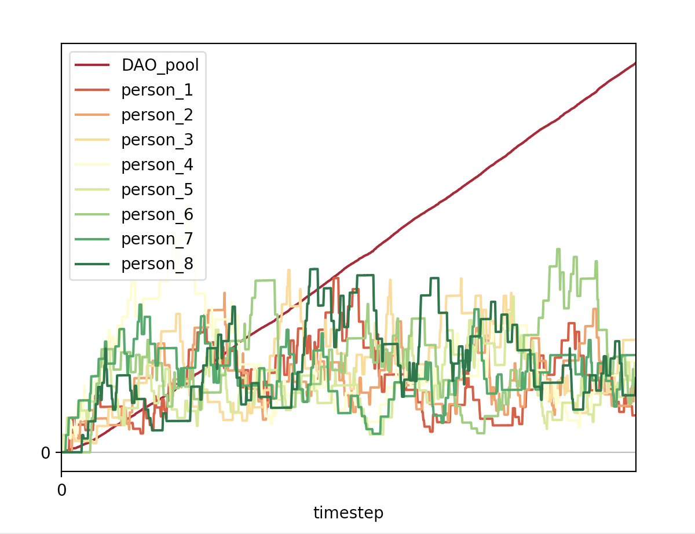

Simulation so far:

- Models individual mint and burn events, DAO tax and redistribution tax
- 50/50 chance of mint or burn at each 'timestep'
- mint event: individual mints 100 tokens
- burn event: individual burns 20% of their tokens
- maximum population of 10 token holders including DAO pool and guildbank

